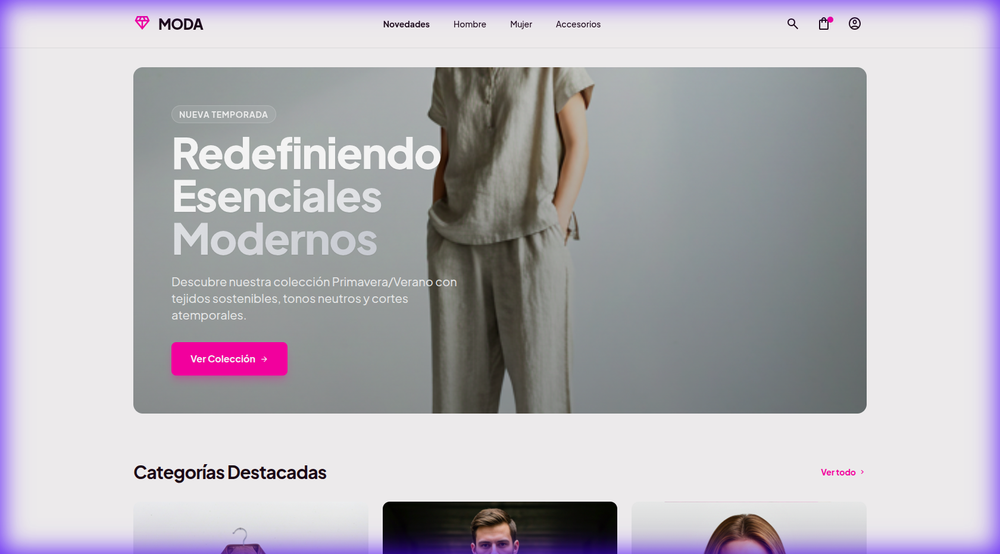
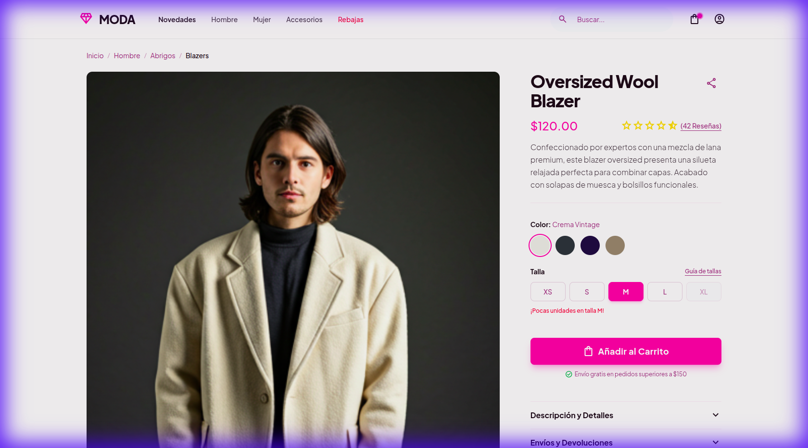
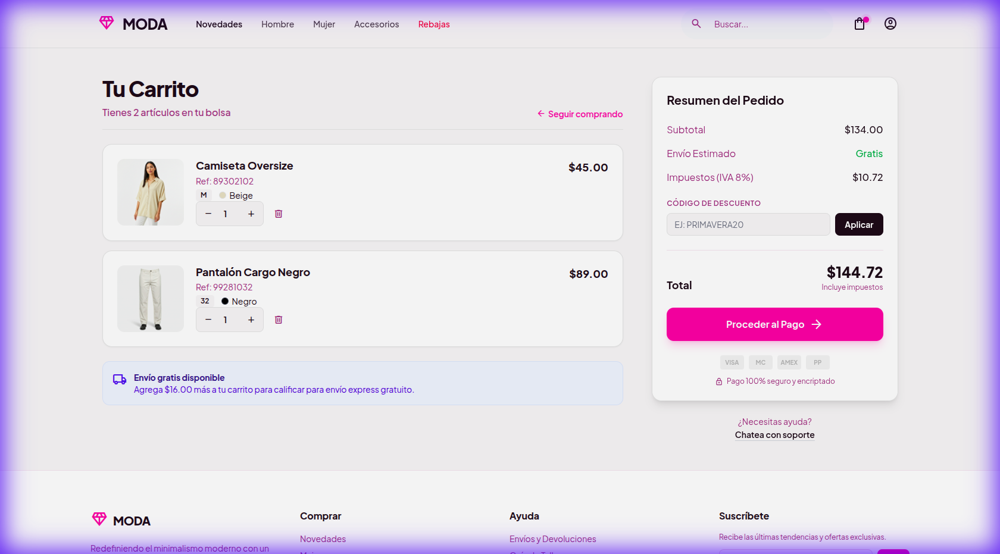

# 🛍️ MODA Store - Modern Fashion E-Commerce


> A high-performance, responsive fashion e-commerce application built with modern web technologies. This project demonstrates a full migration from static HTML to a robust React architecture, featuring a comprehensive Admin Dashboard and optimized Docker deployment.



## ✨ Key Features

### 🛒 Customer Experience
- **Responsive Design**: Mobile-first approach ensuring a seamless experience across all devices.
- **Dynamic Product Catalog**: Browse collections with category filtering and detailed product views.
- **Interactive Cart & Checkout**: Fully functional cart management and a streamlined checkout flow.
- **Dark Mode Support**: Built-in visual comfort with system-aware dark mode.
- **High Performance**: Optimized assets served locally for lightning-fast load times.

### 📊 Admin Panel
- **Dashboard Overview**: Real-time visualization of sales, orders, and inventory stats.
- **Order Management**: Track and manage customer orders with status indicators.
- **Customer Insights**: detailed client database.
- **Product Management**: Intuitive interface for adding new inventory and managing media.

## 📸 Screenshots

| **Admin Dashboard** | **Product Details** |
|:---:|:---:|
|  |  |
| **Shopping Cart** | **Secure Checkout** |
|  |  |

## 🚀 Experience It Locally

### Option 1: Docker (Recommended)
Deploy the entire application in seconds using Docker Compose.

```bash
# Clone the repository
git clone https://github.com/yourusername/moda-store.git
cd moda-store

# Run with Docker Compose
docker-compose up --build
```
Access the app at `http://localhost:8080`.

### Option 2: Local Development (Node.js)
```bash
# Navigate to the app directory
cd moda-app

# Install dependencies
npm install

# Start the development server
npm run dev
```
Access the app at `http://localhost:5173`.

## 🛠️ Technical Stack

- **Frontend Framework**: [React 18](https://reactjs.org/)
- **Build Tool**: [Vite](https://vitejs.dev/)
- **Styling**: [Tailwind CSS v4](https://tailwindcss.com/) + PostCSS
- **Routing**: [React Router v7](https://reactrouter.com/)
- **Deployment**: [Docker](https://www.docker.com/) + Nginx (Alpine Linux)
- **Icons**: Google Material Symbols
- **Fonts**: Plus Jakarta Sans & Inter

## 📂 Project Structure

```
moda-app/
├── public/          # Static assets (images, icons)
├── src/
│   ├── components/  # Reusable UI components
│   ├── layouts/     # Main and Admin layouts
│   ├── pages/       # Application views
│   │   ├── admin/   # Admin panel pages
│   │   └── ...      # Public pages (Home, Login, Cart)
│   ├── App.jsx      # Main application router
│   └── index.css    # Tailwind entry point
├── Dockerfile       # Multi-stage build configuration
└── nginx.conf       # SPA server configuration
```

---
*By [Your Name]*
